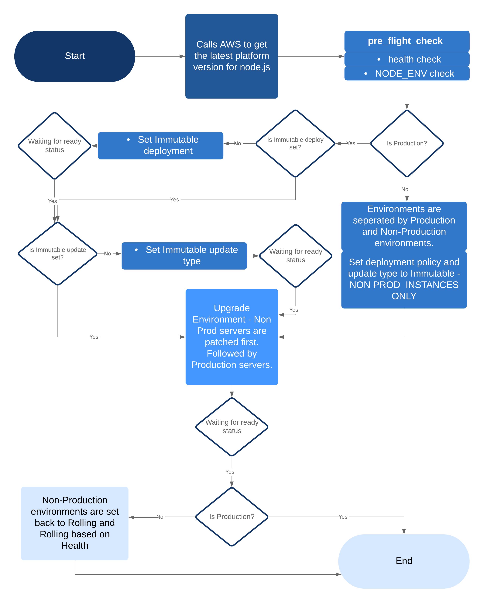

# Platform Update Tool & enhanced Reporting

This tool is used in conjunction with AWS Managed Update releases for Elasticbeanstalk platforms. This tool will compare the existing version of node on each server against latest possible version of node that is compatible with the latest platform. If the existing version of node.js is no longer available this tool will upgrade the platform while upgrading node.js to the next minor release available.

## Prerequisites
Python 3

## Architecture

## Parameters

### NEXT SECTION

## NEXT SECTION

